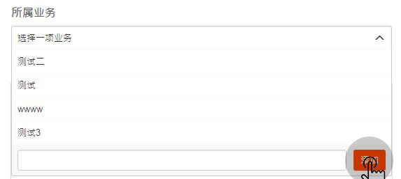
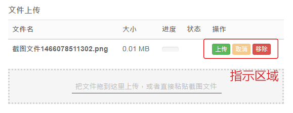
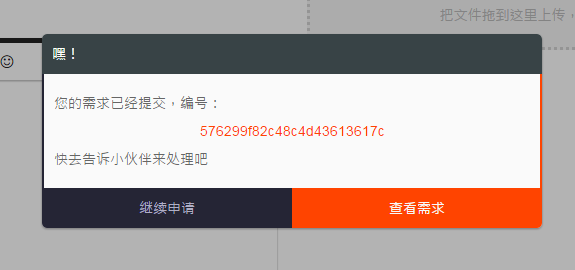
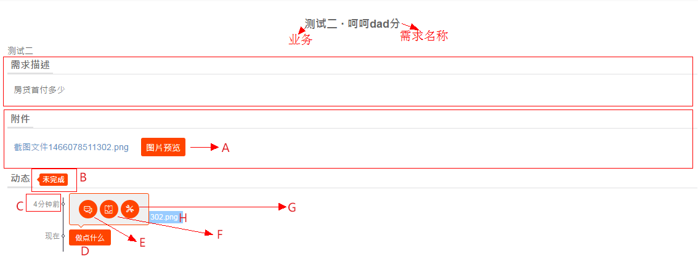
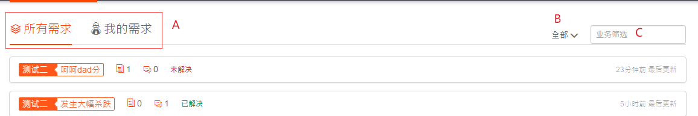

# 需求提报系统


- 主色：#FF4400 (255, 68, 0)
- 对比色：#252535 (37, 37, 53)
- 完成色：#009966 (0, 153, 102)

## 部署指引

### 环境要求

- NodeJS >= 4.4.4（LTS）
- Mongodb >= 3.2.0

	*Mongodb用到了3.2.0才加进来的 `$lookup`*

### 操作步骤

``` bash
git clone https://github.com/o2team/bughound.git

cd bughound

npm install

# 手动创建文件夹，嗯手动
mkdir database/data
mkdir upload

# 启动 Mongodb
mongod --dbpath database/data
# 手动添加第一个管理员用户，嗯手动，看下./database/index.js里的数据结构
db.users.save({ erp:"xxxx", name:"右小镇", email:"xxxx@xx.com", isadmin:1 })

# 运行
node server
```

## 用户指引

### 角色

分为3种角色，分别为管理员、开发者和需求方，所有角色有以下权限：

- 新建与修改业务
- 申请需求
- 驳回需求
- 需求评论
- 附件上传

#### 管理员

**角色创建**

- 手动到数据库创建
- 手动到数据库修改现有用户

**角色权限**
- 管理开发者角色
- 完成需求

#### 开发者

**角色创建**

- 管理员创建

**角色权限**

- 完成需求

#### 需求方

**角色创建**

无需创建，等同游客用户

### 需求申请

必填项：`需求名称` 与 `所属业务`

1. 填写需求名称
2. 填写所属业务

	选择一项业务，如果没有找到，可以即时新建，如图所示：

	

3. 填写需求描述
4. 文件上传
	
	

	你可以把文件拖到指示区域上传文件，当然更方便地，你可以截完图后在页面执行粘贴操作即可把截图文件添加到上传队列
	
	*Chrome用户在整个页面的所有区域执行粘贴操作都可以实现，其他浏览器用户请先把光标定位到指示区域即点一下，然后再粘贴*

	队列信息包括：文件名、文件大小、进度、状态与操作。其中注意：

	- 状态分三种，均为图标示意：上传成功（✔）；上传失败（乄）；上传取消
	- 三种操作：上传单个文件；文件上传中取消单个上传；从队列移除单个文件

5. 提交需求

	

	提交成功后你将看到这个弹框，把ID交给你的好朋友前端同学，TA懂怎么做的，然后可以继续申请或者查看刚刚申请的需求

### 需求处理

现在来到刚刚提交的那个需求，如图所示



- 所有的附件（包括动态里上传的文件）都会出现在附件一栏，点击即可下载，如果有图片文件，`按钮A` 会显示，点击进入图片预览
- `标签B` 指示了需求的状态
- 动态里的 `时间C` 代表每条动态的时间
- 点击 `按钮D` 弹出图示弹框
- 点击 `按钮E` 发表评论，可以使用表情图标
- 点击 `按钮F` 文件上传，相关注意事项跟需求申请里的文件上传一样
- 点击 `按钮G` 处理需求：驳回需求 / 完成需求
- 动态会显示在 `区域H`，文件会以图示的蓝色标签展现，点击即可下载

### 游览广场



广场页展示了每条需求的所属业务、名称、附件个数、动态数、状态以及最后更新时间

- `区域A` 可以切换所有需求和我的需求
- `选项B` 可以选择特定状态的需求
- `输入C` 可以选择指定业务下的需求

### 业务管理

该页展示了每个业务下的需求数量，你也可以修改业务的名字，如果业务下的需求较多，请谨慎修改